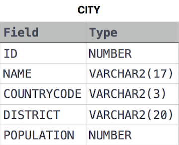

## 📌 Problem
Given the **CITY** and **COUNTRY** tables, query the sum of the populations of all cities where the CONTINENT is 'Asia'.

**Note**: CITY.CountryCode and COUNTRY.Code are matching key columns.

**Input Format**

The **CITY** and **COUNTRY** tables are described as follows: 




where LAT_N is the northern latitude and LONG_W is the western longitude.

<br>

## 📌 Code
```sql
select sum(city.population)
from city
join country
on city.countrycode = country.code
where continent = 'Asia'
```