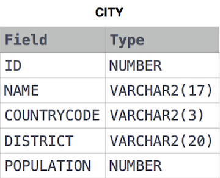

## 📌 Problem
Query the names of all the Japanese cities in the CITY table. The COUNTRYCODE for Japan is JPN.

The CITY table is described as follows:



## 📌 Code
```sql
SELECT NAME
FROM CITY
WHERE COUNTRYCODE='JPN';
```