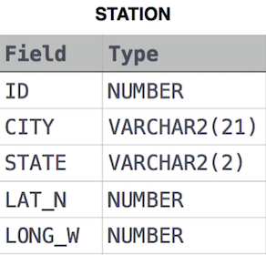

## 📌 Problem
Query the list of CITY names ending with vowels (a, e, i, o, u) from STATION. Your result cannot contain duplicates.

Input Format

The STATION table is described as follows:



where LAT_N is the northern latitude and LONG_W is the western longitude.

</br>

## 📌 Code
```sql
SELECT DISTINCT CITY
FROM STATION
WHERE RIGHT(CITY, 1) IN ('a', 'e', 'i', 'o', 'u');
```