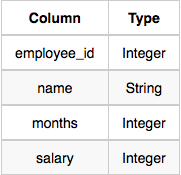
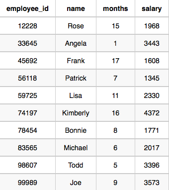

## 📌 Problem
Write a query that prints a list of employee names (i.e.: the name attribute) for employees in Employee having a salary greater than `$2000` per month who have been employees for less than `10` months. Sort your result by ascending employee_id.

**Input Format**

The Employee table containing employee data for a company is described as follows:



where employee_id is an employee's ID number, name is their name, months is the total number of months they've been working for the company, and salary is their monthly salary.

**Sample Input**



**Sample Output**
```
Angela
Michael
Todd
Joe
```

**Explanation**

Angela has been an employee for `1` month and earns `$3443` per month.<br>
Michael has been an employee for `6` months and earns `$2017` per month.<br>
Todd has been an employee for `5` months and earns `$3396` per month.<br>
Joe has been an employee for `9` months and earns `$3573` per month.<br>
We order our output by ascending employee_id.

</br>

## 📌 Code
```sql
SELECT NAME
FROM Employee
WHERE salary > 2000 and months < 10
ORDER BY employee_id
```