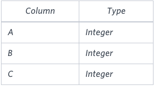
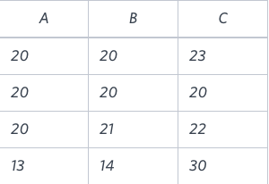

## 📌 Problem
Write a query identifying the type of each record in the TRIANGLES table using its three side lengths. Output one of the following statements for each record in the table:

- **Equilateral**: It's a triangle with  sides of equal length.
- **Isosceles**: It's a triangle with  sides of equal length.
- **Scalene**: It's a triangle with  sides of differing lengths.
- **Not A Triangle**: The given values of A, B, and C don't form a triangle.

**Input Format**

The TRIANGLES table is described as follows:



Each row in the table denotes the lengths of each of a triangle's three sides.

**Sample Input**



**Sample Output**
```
Isosceles
Equilateral
Scalene
Not A Triangle
```
**Explanation**

Values in the tuple `(20,20,23)` form an Isosceles triangle, because `A=B`.<br>
Values in the tuple `(20,20,20)` form an Equilateral triangle, because `A=B=C`. Values in the tuple `(20,21,22)` form a Scalene triangle, because `A<>B<>C`.<br>
Values in the tuple `(13,14,30)` cannot form a triangle because the combined value of sides `A` and `B` is not larger than that of side `C`.

</br>

## 📌 Code
`CASE~WHEN`절에서는 순서가 중요하다. <br>
이미 첫 번째 기준을 충족시키면 그 다음 WHEN 절에서는 포함되지 않는다.
```sql
SELECT
    CASE
        WHEN A=B and B=C THEN 'Equilateral'
        WHEN A+B<=C or A+C<=B or B+C<=A THEN 'Not A Triangle'
        WHEN A=B or B=C or A=C THEN 'Isosceles'    
        ELSE 'Scalene'
    END 
FROM TRIANGLES
```