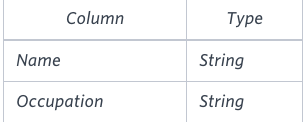

## 📌 Problem
Generate the following two result sets:

1. Query an alphabetically ordered list of all names in **OCCUPATIONS**, immediately followed by the first letter of each profession as a parenthetical (i.e.: enclosed in parentheses). For example: AnActorName(A), ADoctorName(D), AProfessorName(P), and ASingerName(S).
2. Query the number of ocurrences of each occupation in OCCUPATIONS. Sort the occurrences in ascending order, and output them in the following format:
    ```
    There are a total of [occupation_count] [occupation]s.
    ```

    where [occupation_count] is the number of occurrences of an occupation in **OCCUPATIONS** and [occupation] is the lowercase occupation name. If more than one Occupation has the same [occupation_count], they should be ordered alphabetically.

**Note**: There will be at least two entries in the table for each type of occupation.

**Input Format**

The **OCCUPATIONS** table is described as follows:  


Occupation will only contain one of the following values: **Doctor**, **Professor**, **Singer** or **Actor**.

**Sample Input**

An **OCCUPATIONS** table that contains the following records:


**Sample Output**
```
Ashely(P)
Christeen(P)
Jane(A)
Jenny(D)
Julia(A)
Ketty(P)
Maria(A)
Meera(S)
Priya(S)
Samantha(D)
There are a total of 2 doctors.
There are a total of 2 singers.
There are a total of 3 actors.
There are a total of 3 professors.
```

**Explanation**

The results of the first query are formatted to the problem description's specifications.
The results of the second query are ascendingly ordered first by number of names corresponding to each profession (2<=2<=3<=3), and then alphabetically by profession (`doctor` <= `singer`, and `actor`<=`professor`).

</=>

## 📌 Code
`CONCAT()` : 문자열 이어주는 역할

- 조건1 : `name`으로 정렬, `occupation`의 첫번째 단어를 괄호로 묶어서 출력.<br>
- 조건2 : `occpuation`을 `GROUP BY`를 통해 묶은 후 `COUNT()`로 갯수 출력,<br> `LOWER()`를 통해 `occupation`을 소문자로 출력<br>
`COUNT(occupation)`(=그룹한 개수로 정렬) 후 `occupation`(=알파벳 순서)로 정렬.
```sql
SELECT CONCAT(name, "(", LEFT(occupation, 1), ")")
FROM OCCUPATIONS
ORDER BY name;

SELECT CONCAT("There are a total of ", COUNT(occupation), " ", lower(occupation), "s.")
FROM OCCUPATIONS
GROUP BY occupation
ORDER BY COUNT(occupation), occupation;
```