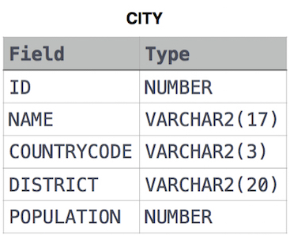

## 📌 Problem
Query a count of the number of cities in CITY having a Population larger than .

**Input Format**

The CITY table is described as follows: 



## 📌 Code
```sql
SELECT COUNT(1) -- =COUNT(*)
FROM city
WHERE population > 100000;
```