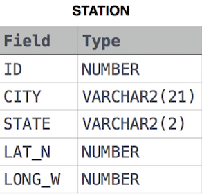

## 📌 Problem
Query the sum of Northern Latitudes (LAT_N) from STATION having values greater than `38.7880` and less than `137.2345`. Truncate your answer to 4 decimal places.

**Input Format**

The **STATION** table is described as follows:



where LAT_N is the northern latitude and LONG_W is the western longitude.

## 📌 Code
```sql
select round(sum(LAT_N), 4)
from station
where LAT_N > 38.7880 and LAT_N < 137.2345
```