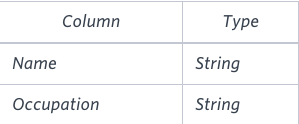

## 📌 Problem
Pivot the Occupation column in **OCCUPATIONS** so that each Name is sorted alphabetically and displayed underneath its corresponding Occupation. The output column headers should be Doctor, Professor, Singer, and Actor, respectively.

**Note**: Print **NULL** when there are no more names corresponding to an occupation.

**Input Format**

The **OCCUPATIONS** table is described as follows:



Occupation will only contain one of the following values: Doctor, Professor, Singer or Actor.

**Sample Input**


**Sample Output**
```
Jenny    Ashley     Meera  Jane
Samantha Christeen  Priya  Julia
NULL     Ketty      NULL   Maria
```

**Explanation**

The first column is an alphabetically ordered list of Doctor names.
The second column is an alphabetically ordered list of Professor names.
The third column is an alphabetically ordered list of Singer names.
The fourth column is an alphabetically ordered list of Actor names.
The empty cell data for columns with less than the maximum number of names per occupation (in this case, the Professor and Actor columns) are filled with **NULL** values.

<br>

## 📌 Code
```sql
select
    min(case when occupation = 'Doctor' then name end) as 'Doctor',
    min(case when occupation = 'Professor' then name end) as 'Professor',
    min(case when occupation = 'Singer' then name end) as 'Singer',
    min(case when occupation = 'Actor' then name end) as 'Actor'
from (
    select name, occupation, row_number() over (partition by occupation order by name) nn
    from occupations
) as tmp
group by nn
```
```
-- result

Aamina Ashley Christeen Eve
Julia Belvet Jane Jennifer
Priya Britney Jenny Ketty
NULL Maria Kristeen Samantha
NULL Meera NULL NULL
NULL Naomi NULL NULL
NULL Priyanka NULL NULL
```

<br>

## 📌 설명
```sql
-- row_number() over (partion by 필드1 order by 필드2) as seq
-- 필드1별로 묶어 각각의 번호를 제공한다.

-- occupation 별로 묶어 번호를 부여한다.
select name, occupation, row_number() over (partition by occupation order by name) nn
from occupations
```
```sql
-- result
Eve Actor 1
Jennifer Actor 2
Ketty Actor 3
Samantha Actor 4
Aamina Doctor 1
Julia Doctor 2
Priya Doctor 3
Ashley Professor 1
Belvet Professor 2
Britney Professor 3
Maria Professor 4
Meera Professor 5
Naomi Professor 6
Priyanka Professor 7
Christeen Singer 1
Jane Singer 2
Jenny Singer 3
Kristeen Singer 4
```

`group by nn`을 하게 되면 아래와 같이 될 것이다.
| group by | name | occupation |
|--|--|--|
|  1 |   Eve| Actor   |
|   |   Aamina| Doctor   |
|   |   Ashley| Professor   |
|   |   Christeen| Singer   |
| 2  |   Jennifer| Actor   |
|   |   Julia| Doctor   |
|   |   Belvet| Professor   |
|   |   Jane| Singer   |
| 3  |   Ketty| Actor   |
|   |   Priya| Doctor   |
|   |   Britney| Professor   |
|   |   Jenny| Singer   |
|  4 |   Samantha| Actor   |
|   |   Maria| Professor   |
|   |   Kristeen| Singer   |
|  5 |   Meera| Professor   |
|  6 |   Naomi| Professor   |
|  7 |   Priyanka| Professor  |

`select` 부분을 보면 `case ~ when`을 `min()`으로 감싸고 있다.<br>
이유는 `group by`를 사용했기 때문에 집계함수가 필요했기 때문에 사용했다.
```sql
-- select 부분
select
    min(case when occupation = 'Doctor' then name end) as 'Doctor',
    min(case when occupation = 'Professor' then name end) as 'Professor',
    min(case when occupation = 'Singer' then name end) as 'Singer',
    min(case when occupation = 'Actor' then name end) as 'Actor'
```

`group by nn`을 사용하지 않으면 아래와 같이 첫번째 row만 출력될 것이다.
```
Aamina Ashley Christeen Eve
```